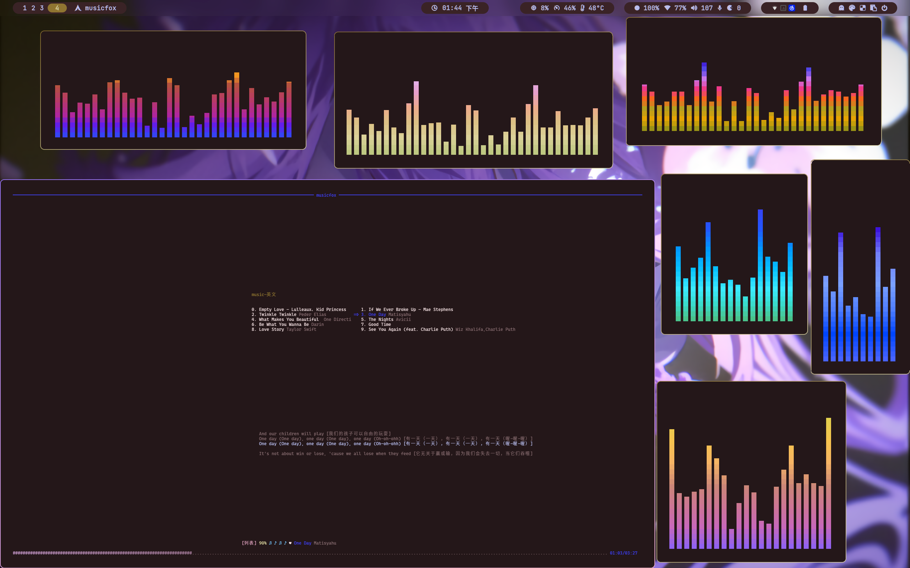
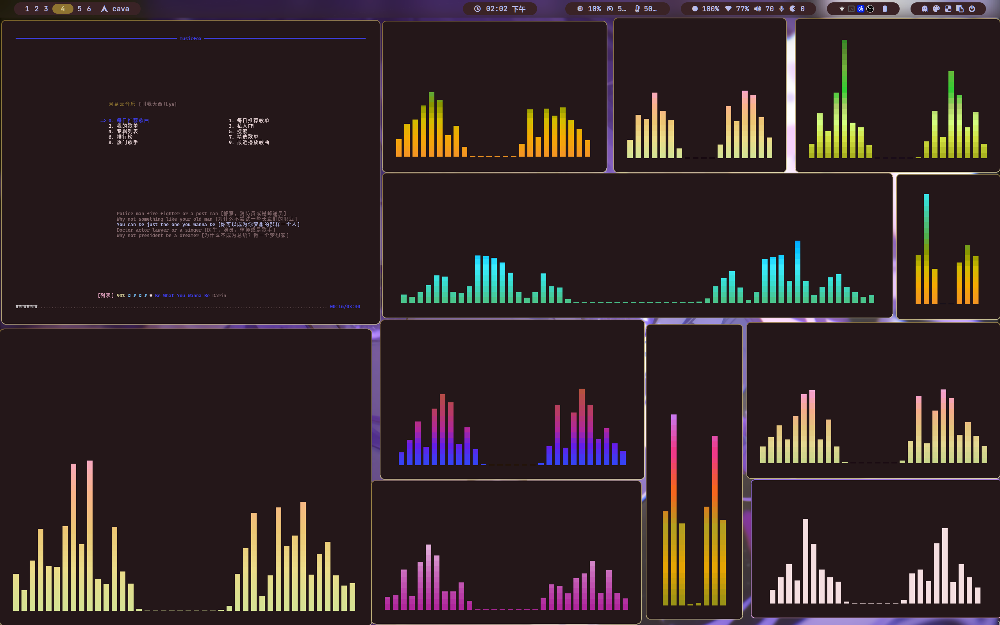

# cava

:fire: About theme for Cava - 关于cava的主题仓库


### 1. cava

> 跨平台音频可视化工具 [cava](https://github.com/karlstav/cava)
>
> [my wiki](https://github.com/vgoer/wiki/blob/master/%E4%BC%98%E7%A7%80%E8%BD%AF%E4%BB%B6/cava.md)


### 2. 配置

> 配置的模板在`config_tmp`

```shell
[general]
bars = 30 ; 频谱条数量
framerate = 60 ; 帧率
samplerate = 44100 ; 采样率
history = 60 ; 历史数据展示时长（秒）

[output]
method = ncurses ; 输出方法

[smoothing]
integral = 5 ; 平滑值
lookback = 10 ; 衰减值

[color]
gradient = 1 ; 使用渐变色
gradient_color_1 = '#179299' ; 渐变颜色 1
gradient_color_2 = '#04a5e5' ; 渐变颜色 2
gradient_color_3 = '#209fb5' ; 渐变颜色 3
gradient_color_4 = '#1e66f5' ; 渐变颜色 4
gradient_color_5 = '#8839ef' ; 渐变颜色 5
gradient_color_6 = '#ea76cb' ; 渐变颜色 6
gradient_color_7 = '#e64553' ; 渐变颜色 7
gradient_color_8 = '#d20f39' ; 渐变颜色 8

[bar]
fall_speed = 2 ; 下降速度
rise_speed = 1 ; 上升速度
bar_width = 2 ; 频谱条宽度
bar_gap = 1 ; 频谱条间距
```


### 3. 手把手教你配置

> 属于自己的主题
>
> >  把渐变的颜色改为自己喜欢的颜色。

```shell
[color]
gradient = 1 ; 使用渐变色
gradient_color_1 = '#179299' ; 渐变颜色 1
gradient_color_2 = '#04a5e5' ; 渐变颜色 2
gradient_color_3 = '#209fb5' ; 渐变颜色 3
gradient_color_4 = '#1e66f5' ; 渐变颜色 4
gradient_color_5 = '#8839ef' ; 渐变颜色 5
gradient_color_6 = '#ea76cb' ; 渐变颜色 6
gradient_color_7 = '#e64553' ; 渐变颜色 7
gradient_color_8 = '#d20f39' ; 渐变颜色 8
```

> 把这个配置文件复制覆盖`config文件`
>
> > 就可以看到自己喜欢的颜色了


###  4.存在的主题

> `theme`主题目录






### 5. 希望

> 希望你能共享你觉得好看的主题，说不定有人喜欢。 比心  --  感谢


